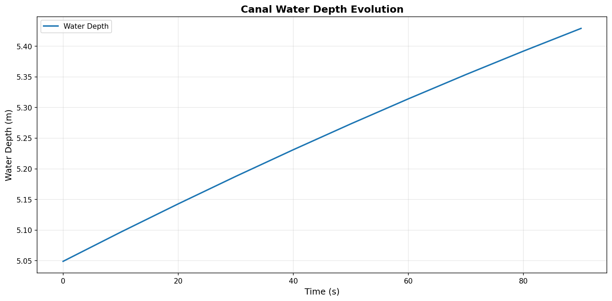
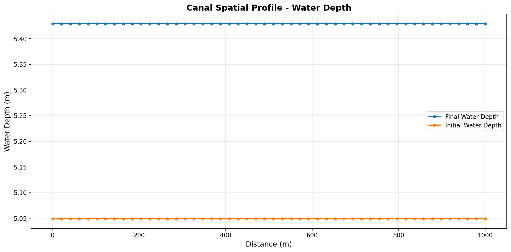
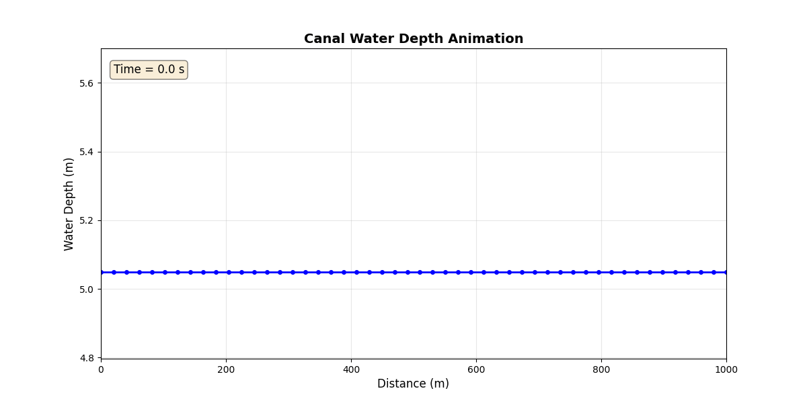

# HydroClaude 可视化与报告生成功能

## 概述

HydroClaude现已支持自动生成可视化结果和详细仿真报告，包括：
- 静态图表（PNG格式）
- 动态GIF动画
- 自动生成的Markdown报告
- 图表自动嵌入到报告中

---

## 新增功能

### 1. 可视化工具 (`utils/visualization.py`)

#### SimulationVisualizer类
- `plot_time_series()`: 绘制时间序列图
- `plot_spatial_profile()`: 绘制空间剖面图
- `create_animation_gif()`: 创建单变量动态GIF
- `create_multi_panel_animation()`: 创建多子图动态GIF

#### ReportGenerator类
- `generate_markdown_report()`: 生成Markdown报告
- `create_summary_table()`: 创建数据表格

### 2. 增强版示例

#### 示例1增强版 (`examples/example_01_simple_canal_enhanced.py`)

**运行方式**:
```bash
cd /home/user/HydroClaude
PYTHONPATH=. python examples/example_01_simple_canal_enhanced.py
```

**生成的文件**:
- `reports/figures/example_01_depth_time.png` - 水深时间序列图
- `reports/figures/example_01_flow_time.png` - 流量时间序列图
- `reports/figures/example_01_depth_profile.png` - 水深空间剖面图
- `reports/figures/example_01_depth_animation.gif` - 水深动态演化（GIF）
- `reports/figures/example_01_flow_animation.gif` - 流量动态演化（GIF）
- `reports/example_01_simulation_report.md` - 自动生成的仿真报告

---

## 使用指南

### 快速开始

```python
from utils.visualization import SimulationVisualizer, ReportGenerator
import numpy as np

# 创建可视化器
viz = SimulationVisualizer(output_dir="reports/figures")

# 1. 绘制时间序列
time = np.linspace(0, 100, 11)
data = {'Water Depth': np.random.randn(11) + 5}
viz.plot_time_series(
    time=time,
    data=data,
    title='Water Depth Evolution',
    ylabel='Depth (m)',
    filename='depth_vs_time.png'
)

# 2. 创建GIF动画
x = np.linspace(0, 1000, 50)
time_data = [np.random.randn(50) + 5 for _ in range(10)]
time_points = np.linspace(0, 100, 10)

viz.create_animation_gif(
    x=x,
    time_data=time_data,
    time_points=time_points,
    title='Spatial Evolution',
    ylabel='Depth (m)',
    filename='animation.gif',
    fps=2
)

# 3. 生成报告
report_gen = ReportGenerator(output_dir="reports")
sections = [
    {
        'heading': '结果分析',
        'content': '这是分析内容...',
        'images': ['reports/figures/depth_vs_time.png']
    }
]
report_gen.generate_markdown_report(
    title='仿真报告',
    sections=sections,
    filename='my_report.md'
)
```

---

## 可视化示例

### 时间序列图



### 空间剖面图



### 动态GIF动画



*GIF动画展示了水深沿渠道纵剖面随时间的演化过程*

---

## API文档

### SimulationVisualizer

#### `plot_time_series(time, data, title, ylabel, filename, figsize=(12, 6))`

绘制时间序列图。

**参数**:
- `time` (np.ndarray): 时间数组
- `data` (Dict[str, np.ndarray]): 数据字典 {标签: 数值}
- `title` (str): 图表标题
- `ylabel` (str): y轴标签
- `filename` (str): 输出文件名
- `figsize` (Tuple[int, int]): 图片尺寸

**返回**: 文件路径

---

#### `plot_spatial_profile(x, data, title, ylabel, filename, figsize=(12, 6))`

绘制空间剖面图。

**参数**:
- `x` (np.ndarray): 空间坐标数组
- `data` (Dict[str, np.ndarray]): 数据字典
- `title` (str): 图表标题
- `ylabel` (str): y轴标签
- `filename` (str): 输出文件名
- `figsize` (Tuple[int, int]): 图片尺寸

**返回**: 文件路径

---

#### `create_animation_gif(x, time_data, time_points, title, ylabel, filename, figsize=(12, 6), fps=10, ylim=None)`

创建GIF动画。

**参数**:
- `x` (np.ndarray): 空间坐标
- `time_data` (List[np.ndarray]): 时间序列数据列表
- `time_points` (np.ndarray): 时间点数组
- `title` (str): 标题
- `ylabel` (str): y轴标签
- `filename` (str): 输出文件名
- `figsize` (Tuple[int, int]): 图片尺寸
- `fps` (int): 帧率（帧/秒）
- `ylim` (Optional[Tuple[float, float]]): y轴范围

**返回**: 文件路径

---

### ReportGenerator

#### `generate_markdown_report(title, sections, filename)`

生成Markdown报告。

**参数**:
- `title` (str): 报告标题
- `sections` (List[Dict]): 章节列表，每个章节包含：
  - `heading` (str): 章节标题
  - `content` (str): 章节内容（Markdown格式）
  - `images` (List[str]): 图片路径列表
- `filename` (str): 输出文件名

**返回**: 文件路径

**章节示例**:
```python
sections = [
    {
        'heading': '仿真概述',
        'content': '本示例模拟了...\n\n**参数**:\n- 长度: 1000m\n- 宽度: 10m',
        'images': []
    },
    {
        'heading': '结果分析',
        'content': '### 水深演化\n\n水深从5.0m增加到5.4m。',
        'images': [
            'reports/figures/depth_time.png',
            'reports/figures/depth_animation.gif'
        ]
    }
]
```

---

## 文件组织

```
HydroClaude/
├── utils/
│   └── visualization.py          # 可视化工具
├── examples/
│   ├── example_01_simple_canal.py            # 原始示例
│   └── example_01_simple_canal_enhanced.py   # 增强版示例
├── reports/
│   ├── example_01_report.md                  # 详细报告（已嵌入图片）
│   ├── example_01_simulation_report.md       # 自动生成报告
│   └── figures/
│       ├── example_01_depth_time.png
│       ├── example_01_flow_time.png
│       ├── example_01_depth_profile.png
│       ├── example_01_depth_animation.gif
│       └── example_01_flow_animation.gif
```

---

## 依赖项

确保已安装以下Python包：
- `numpy`
- `matplotlib`
- `pillow` (用于GIF生成)
- `scipy` (可选，某些功能需要)

安装命令：
```bash
pip install numpy matplotlib pillow scipy
```

---

## 性能考虑

### GIF文件大小
- 默认DPI: 100 (可调整)
- 默认FPS: 10帧/秒 (可调整)
- 建议帧数: 10-20帧
- 典型文件大小: 50-100 KB

### 优化建议
1. **减少帧数**: 对于长时间仿真，只保存关键时间点
2. **降低DPI**: 对于预览，使用dpi=75
3. **减少空间点数**: 对于长渠道，使用粗网格可视化

示例：
```python
# 只保存每10步的结果用于动画
save_interval = 10
for i in range(n_steps):
    states = simulator.step(dt, control_inputs)
    if i % save_interval == 0:
        spatial_profiles.append(get_profile())
```

---

## 常见问题

### Q: GIF动画太大怎么办？
A: 减少帧数和DPI：
```python
viz.create_animation_gif(..., fps=5, dpi=75)
```

### Q: 如何自定义图表样式？
A: 直接修改`utils/visualization.py`中的matplotlib参数，或在调用前设置：
```python
import matplotlib.pyplot as plt
plt.rcParams['font.size'] = 14
plt.rcParams['figure.dpi'] = 150
```

### Q: 如何添加多个子图动画？
A: 使用`create_multi_panel_animation()`方法：
```python
data_dict = {
    'depth': [depth_t0, depth_t1, ...],
    'flow': [flow_t0, flow_t1, ...],
    'velocity': [vel_t0, vel_t1, ...]
}
viz.create_multi_panel_animation(
    x=x,
    data_dict=data_dict,
    time_points=time_points,
    filename='multi_panel.gif',
    titles={'depth': 'Water Depth', 'flow': 'Flow Rate', ...},
    ylabels={'depth': 'h (m)', 'flow': 'Q (m³/s)', ...}
)
```

---

## 贡献

欢迎贡献新的可视化功能！请fork项目并提交pull request。

建议的扩展：
- [ ] 3D表面图
- [ ] 交互式图表（Plotly）
- [ ] 视频输出（MP4）
- [ ] 实时仿真可视化

---

## 许可证

与主项目相同的许可证。

---

**最后更新**: 2025-10-21
**版本**: 2.0
