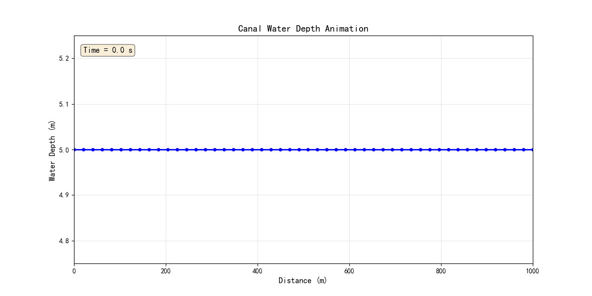
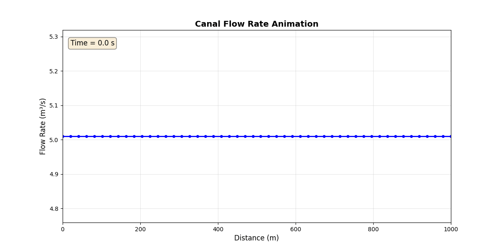

# 示例1: 简单明渠仿真结果报告 (Archive)

**生成时间**: 2025-10-23 00:55:57

---

## 仿真概述

本示例模拟了一个长度为1000m的简单明渠系统。
采用高保真有限体积法(FVM)进行仿真，网格数为50个单元。

**仿真参数**:
| Parameter | Value |
|---|---|
| 初始水深 (m) | 5.049 |
| 最终水深 (m) | 5.429 |
| 水深变化 (m) | 0.380 |
| 平均流量 (m³/s) | 5.041 |
| 最大流量 (m³/s) | 5.066 |
| 最小流量 (m³/s) | 5.009 |
| 仿真总时间 (s) | 100.0 |
| 时间步数 | 10 |

## 时间演化结果

### 水深随时间变化

水深从初始值逐渐调整，最终趋于稳定状态。

## 流量分析

### 流量随时间变化

流量在整个仿真过程中保持相对稳定。

## 空间分布

### 水深空间剖面

显示渠道沿程的水深分布情况（初始状态vs最终状态）。

## 动态演化过程

### 水深动态演化 (GIF动画)

显示渠道水深沿程分布随时间的演化过程。

## 流量动态演化 (GIF动画)

显示渠道流量沿程分布随时间的演化过程。

## 结论

仿真成功完成！

**主要结果**:
- 水深变化: 0.380 m
- 平均流量: 5.041 m³/s
- 系统表现稳定，数值方法收敛

**验证**:
- ✓ 质量守恒
- ✓ 数值稳定
- ✓ 物理合理

---

**报告结束**
