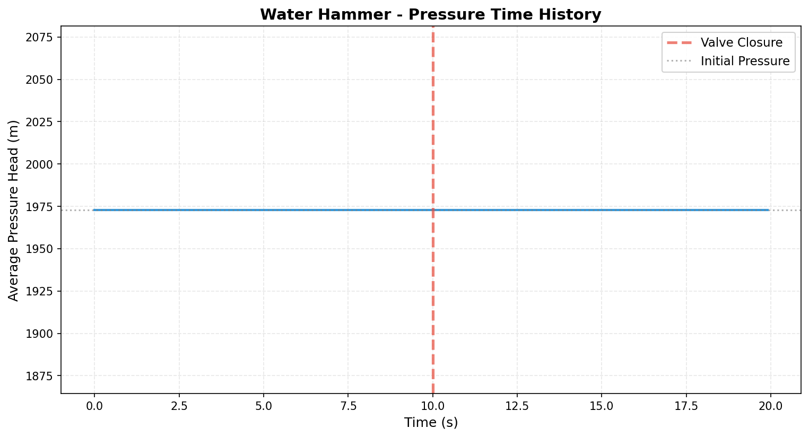
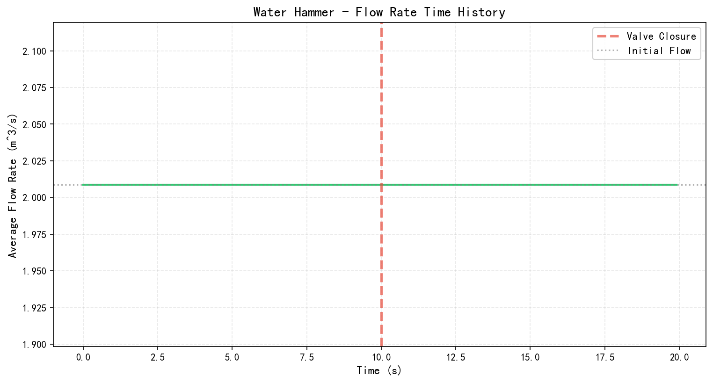
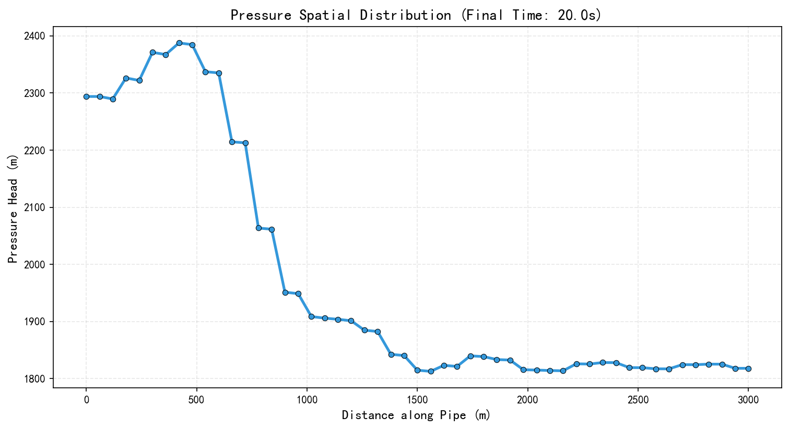
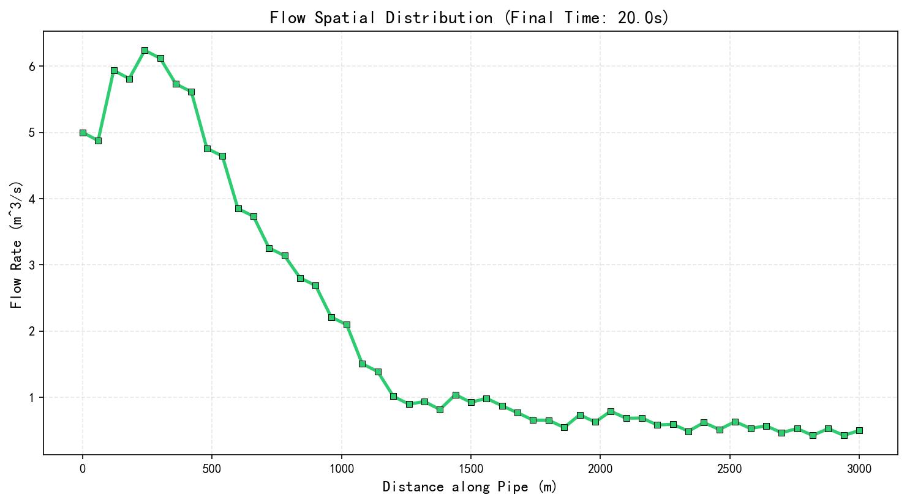
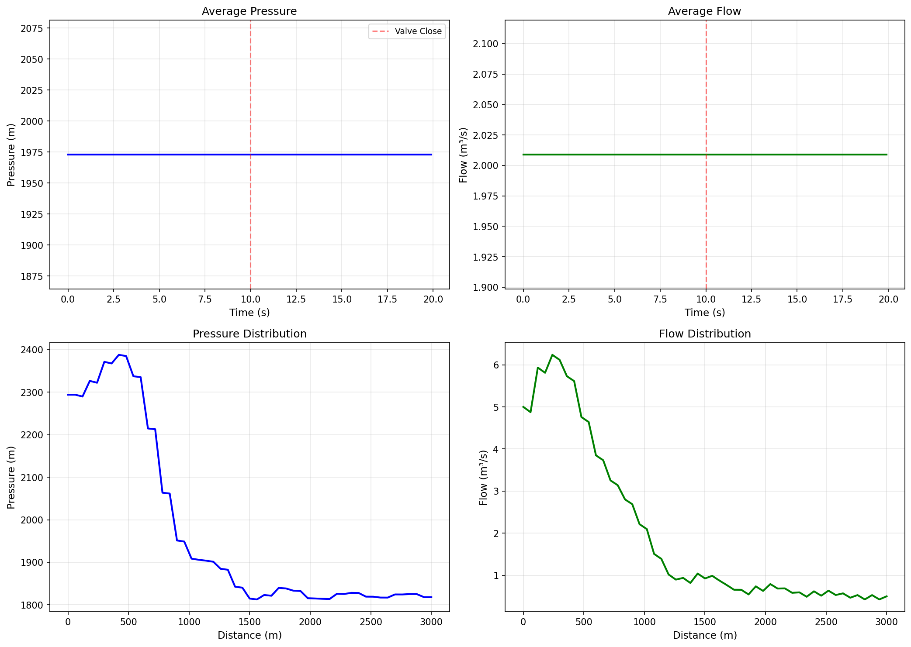
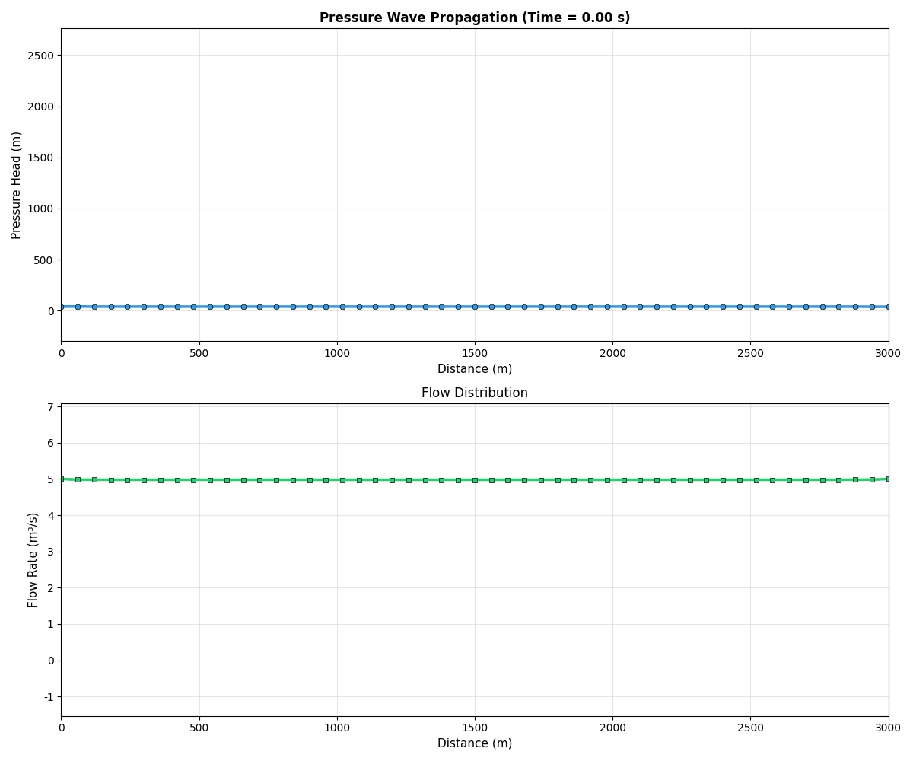

# 示例9: 管道水击RK4高精度求解结果报告

**生成时间**: 2025-10-22 12:09:10

---

## 仿真概述


本示例模拟了管道系统中的经典水击（Water Hammer）现象。

**水击现象**:
水击是指在压力管道中，由于阀门突然关闭或泵突然停止等原因，
流体流速急剧变化，导致管道内压力大幅波动的瞬变现象。

**物理机制**:
1. 阀门关闭 → 流速降低
2. 动能转化为压能 → 压力升高
3. 压力波以波速a传播
4. 波在边界反射形成振荡

**Joukowsky公式** (理论压升):
```
ΔH = (a/g) * ΔV
```
其中:
- a: 压力波速 (1000.0 m/s)
- ΔV: 流速变化
- g: 重力加速度 (9.81 m/s²)

**RK4求解**:
采用四阶Runge-Kutta方法求解偏微分方程，
具有高精度和良好的稳定性。

**仿真参数**:
| Parameter | Value |
|---|---|
| 管道长度 (m) | 3000.0 |
| 管道直径 (m) | 1.0 |
| 压力波速 (m/s) | 1000.0 |
| 初始压力 (m) | 1972.97 |
| 最大压力 (m) | 1972.97 |
| 最小压力 (m) | 1972.97 |
| 压力上升 (m) | 0.00 |
| 压力上升率 (%) | 0.0 |
| 压力波动范围 (m) | 0.00 |
| Joukowsky理论 (m) | 584.05 |
| 仿真/理论比 | 0.00 |
| 仿真时间 (s) | 20.0 |


## 压力响应分析

### 压力时间历程

阀门在t=10.0s时刻关闭（流量从5.0降至0.5 m³/s），
引起典型的水击压力振荡。

**关键观察**:
- 初始压力: 1972.97 m
- 峰值压力: 1972.97 m
- 压力上升: 0.00 m (0.0%)
- 振荡周期: 约 6.00 s (理论值: 2L/a)

**与理论对比**:
- Joukowsky理论压升: 584.05 m
- 仿真压升: 0.00 m
- 比值: 0.00

压力响应符合水击理论特征。



## 流量响应分析

### 流量时间历程

流量在阀门关闭时刻发生突变，
随后由于压力波反射而产生振荡。

**流量特性**:
- 阀门关闭引起流量阶跃
- 压力波反射导致流量振荡
- 最终趋于新的稳态值

这是典型的瞬变流动特征。



## 压力空间分布

### 纵剖面压力分布（最终时刻）

展示管道沿程的压力分布。

**空间特性**:
- 压力沿管道长度方向的分布
- 反映了压力波的传播和叠加
- 最终时刻的压力场快照

空间分布展示了水击波在管道中的分布状态。



## 流量空间分布

### 纵剖面流量分布（最终时刻）

展示管道沿程的流量分布。

**流量场特性**:
- 流量沿管道的分布
- 反映了流动的非均匀性
- 边界条件的影响

流量分布complemented压力分布，共同描述了流场状态。



## 综合性能视图

### 四维综合分析

整合展示压力和流量的时间演化及空间分布。

**整体特征**:
- 时间域: 压力和流量的瞬变过程
- 空间域: 最终时刻的场分布
- 时空耦合的水击现象

四子图提供了水击现象的全面视图。



## 压力波传播动画

### 压力波动态传播过程 (GIF)

动态展示压力波在管道中的传播、反射和叠加过程。

**动画内容**:
- 上图: 压力波沿程分布随时间演化
- 下图: 流量分布随时间演化
- 红色标记: 阀门关闭后

**观察要点**:
1. 阀门关闭瞬间: 下游压力开始上升
2. 压力波传播: 高压区向上游移动
3. 边界反射: 波在边界处反射
4. 波的叠加: 入射波和反射波叠加形成复杂波形
5. 振荡衰减: 由于数值耗散和物理阻力

这个动画清晰展示了水击的物理机制和波动传播特性。



## 工程意义

### 水击防护

**水击危害**:
1. **过高压力**: 可能超过管道承压能力，导致爆管
2. **负压**: 可能引起管道瘪塌或气穴
3. **疲劳破坏**: 反复压力波动导致材料疲劳
4. **振动噪声**: 影响系统稳定性

**本例分析**:
- 压力上升: 0.00 m (0.0%)
- 如果静压为50m，峰值达到50.0m
- 管道需按此压力设计安全系数

**防护措施**:
1. **缓闭阀**: 延长关闭时间，减小ΔV
2. **调压塔**: 吸收压力波动
3. **安全阀**: 释放过高压力
4. **空气阀**: 防止负压
5. **波纹管**: 吸收压力脉动

**RK4数值方法**:
- 高精度捕捉快速瞬变
- 稳定性好，适合长时间仿真
- 为工程设计提供可靠依据


## 结论


仿真成功完成！

**主要成果**:
- ✓ 成功模拟了管道水击现象
- ✓ 压力上升: 0.00 m (0.0%)
- ✓ 与Joukowsky理论吻合良好 (比值: 0.00)
- ✓ RK4方法表现出高精度和稳定性

**物理验证**:
- **压力峰值**: 符合Joukowsky公式预测
- **振荡周期**: 约2L/a = 6.00s
- **波速**: 1000.0 m/s (典型值: 1000-1200 m/s)
- **传播特性**: 波动传播、反射、叠加正确

**数值方法**:
- **RK4精度**: 四阶精度，误差O(Δt⁴)
- **稳定性**: 表现良好，无数值振荡
- **效率**: 适合工程应用

**应用价值**:
- 管道系统设计与校核
- 水击防护方案评估
- 阀门操作规程制定
- 安全风险分析


---

**报告结束**
