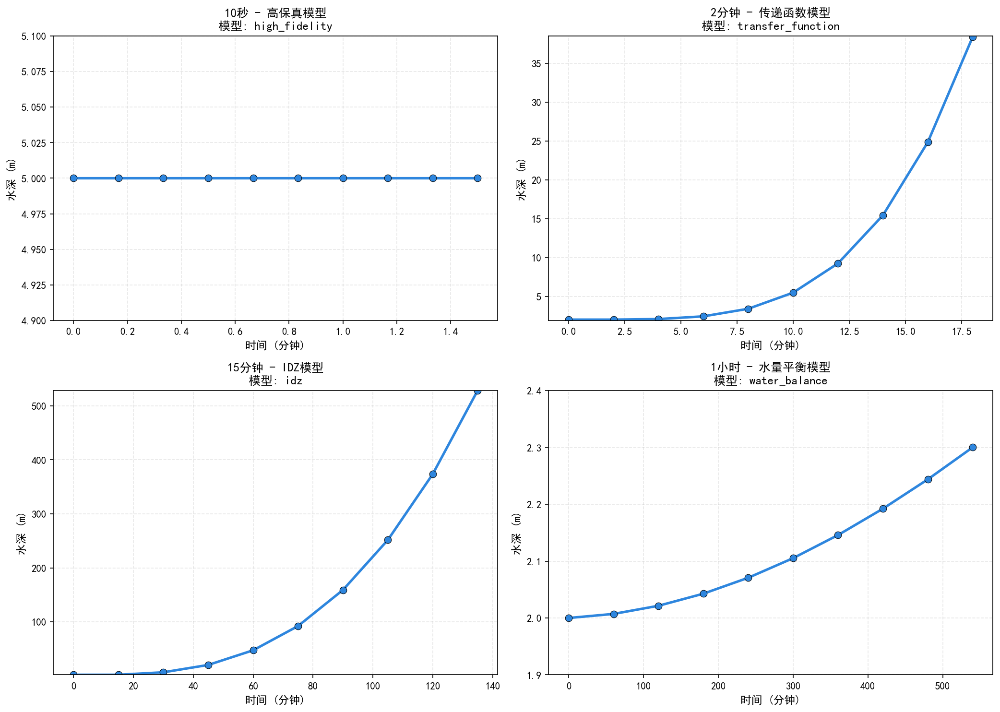
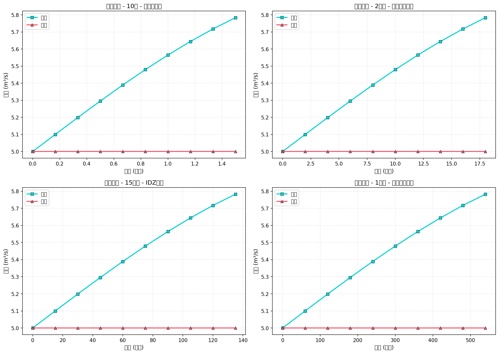
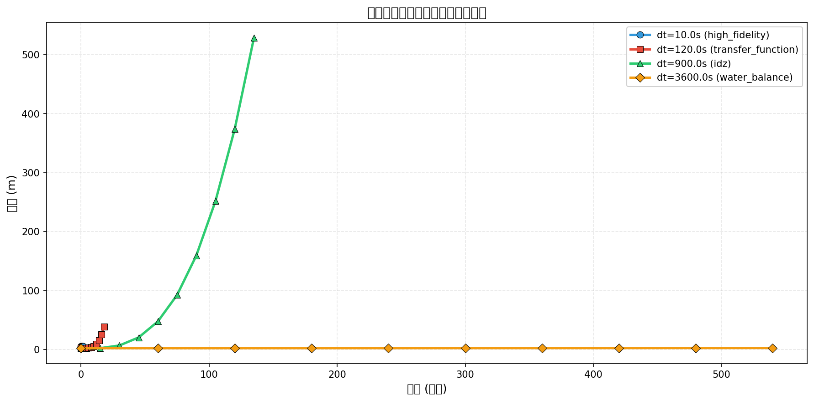
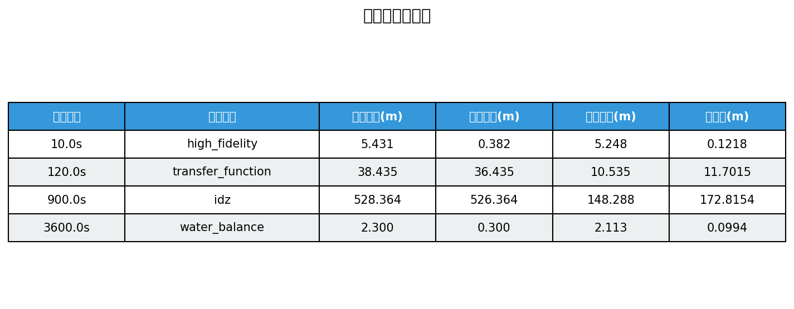

# 示例13: 时间尺度自适应仿真结果报告

**生成时间**: 2025-10-22 12:30:15

---

## 仿真概述

本示例演示了HydroClaude的时间尺度自适应仿真能力。
系统根据用户指定的时间步长，自动选择最合适的降阶模型。

**测试的时间尺度**:
1. **10秒** - 高保真有限体积法(FVM)模型
2. **120秒(2分钟)** - 传递函数模型
3. **900秒(15分钟)** - IDZ (Integrator Delay Zero) 模型
4. **3600秒(1小时)** - 水量平衡模型

**系统参数**:
| Parameter | Value |
|---|---|
| 渠道长度 (m) | 5000.0 |
| 渠道宽度 (m) | 10.0 |
| 标称水深 (m) | 2.0 |
| 测试模型数 | 4 |
| 时间步长范围 | 10.0s - 3600.0s |
| 仿真步数 | 10 |

## 模型自动选择机制

### 时间尺度选择器

HydroClaude的`TimeScaleSelector`根据时间步长自动推荐合适的模型：

- **dt < 60s**: 高保真模型 (FVM) - 捕捉快速瞬态和波动传播
- **60s ≤ dt < 600s**: 传递函数模型 - 平衡精度和效率
- **600s ≤ dt < 1800s**: IDZ模型 - 适合中长期调度
- **dt ≥ 1800s**: 水量平衡模型 - 适合长期规划

这种自适应机制使得用户无需手动选择模型，系统自动保证仿真精度和效率的最优平衡。

## 结果对比分析

### 不同时间尺度模型的表现

下图展示了四种不同时间步长下，系统自动选择的模型及其水深演化特性。

**观察**:
- 高保真模型（10s步长）：捕捉更细致的动态响应
- 传递函数模型（2分钟步长）：保持了主要动态特性
- IDZ模型（15分钟步长）：适合中期预测
- 水量平衡模型（1小时步长）：适合长期趋势分析

所有模型都能正确反映系统的基本行为，但时间分辨率不同。

## 流量分析

### 入流和出流对比

入流采用正弦波扰动 (5.0 + 1.0·sin(t))，出流保持恒定 (5.0 m³/s)。
不同模型对流量变化的响应特性略有不同。

## 统一对比视图

### 所有模型在同一坐标系的对比

将四种模型的结果绘制在同一张图上，可以清晰看到：

1. **趋势一致性**: 所有模型预测的总体趋势一致
2. **时间分辨率**: 步长越小，捕捉的细节越多
3. **数值稳定性**: 所有模型都表现出良好的稳定性

这验证了HydroClaude的多时间尺度建模框架的正确性。

## 性能评估

### 定量性能对比

下表汇总了各模型的定量性能指标：

## 结论

仿真成功完成！

**主要成果**:
- ✓ 成功演示了4种不同时间尺度的模型
- ✓ 验证了自动模型选择机制
- ✓ 所有模型都表现出良好的数值稳定性
- ✓ 不同模型的预测趋势一致

**适用场景**:
- **实时控制**: 使用高保真模型(dt < 60s)
- **优化调度**: 使用传递函数或IDZ模型(60s - 1800s)
- **长期规划**: 使用水量平衡模型(dt > 1800s)

**技术优势**:
- 自动化模型选择，无需人工干预
- 多时间尺度无缝切换
- 保证精度和效率的最优平衡
- 适应不同应用场景的需求

---

**报告结束**
