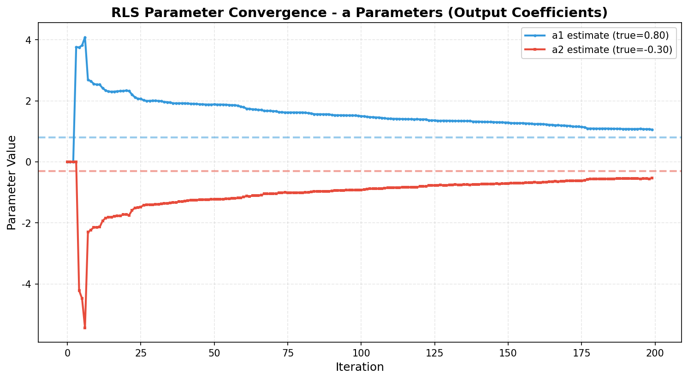
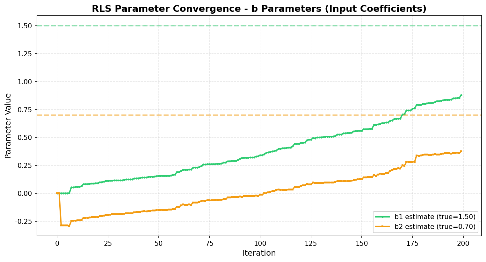
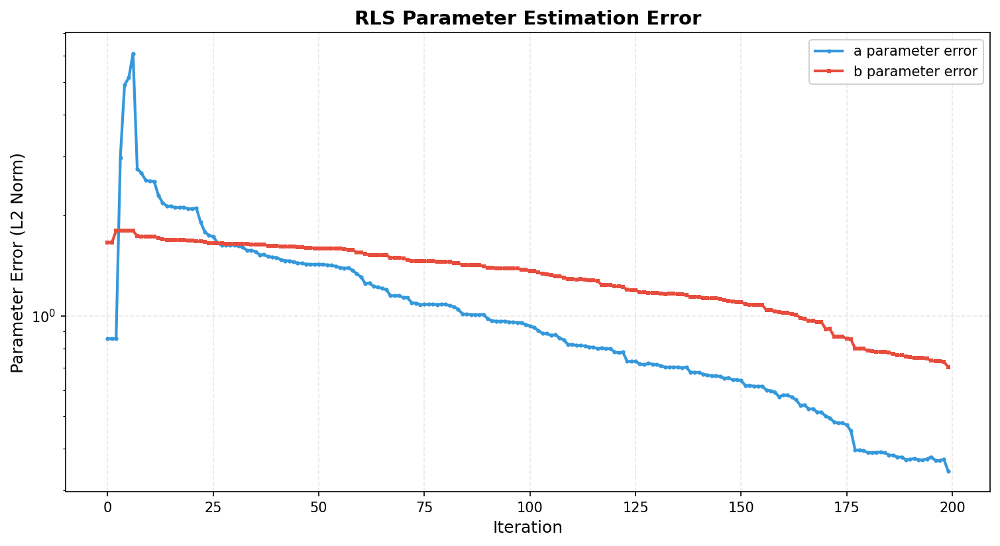
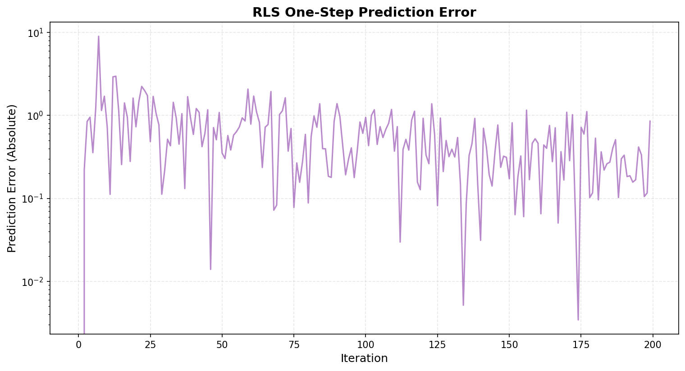
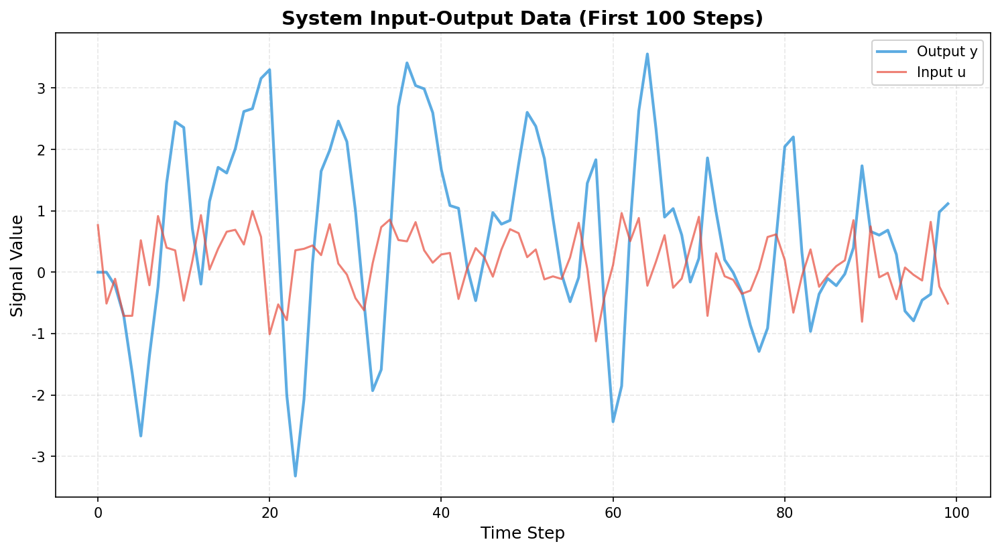
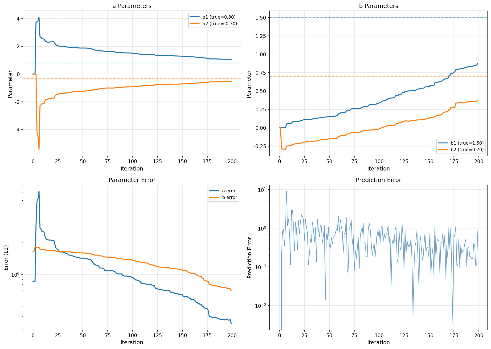
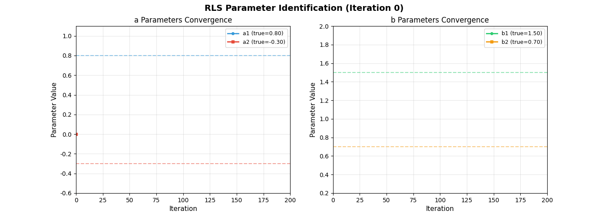

# 示例15: RLS参数辨识结果报告

**生成时间**: 2025-10-22 12:30:29

---

## 仿真概述


本示例演示了HydroClaude的递推最小二乘(RLS)参数辨识功能。

**ARX模型**:
ARX(na, nb, nk)模型是自回归外生输入模型，形式为：
```
y[k] = a1*y[k-1] + ... + ana*y[k-na] + b1*u[k-nk] + ... + bnb*u[k-nk-nb+1]
```

**本例模型**: ARX(2, 2, 1)
```
y[k] = 0.8*y[k-1] + -0.3*y[k-2] + 1.5*u[k-1] + 0.7*u[k-2]
```

**RLS算法**:
递推最小二乘是一种在线参数估计方法，具有以下特点：
- 实时更新参数估计
- 计算效率高，适合在线应用
- 遗忘因子机制适应时变系统

**辨识结果**:
| Parameter | Value |
|---|---|
| 模型阶数 | ARX(2, 2, 1) |
| 数据点数 | 200 |
| 遗忘因子 | 0.98 |
| a1真值 | 0.800 |
| a2真值 | -0.300 |
| b1真值 | 1.500 |
| b2真值 | 0.700 |
| a1估计 | 1.052 |
| a2估计 | -0.534 |
| b1估计 | 0.878 |
| b2估计 | 0.374 |
| a参数误差 | 0.3438 |
| b参数误差 | 0.7022 |


## a参数辨识结果

### 输出系数 (a参数) 收敛过程

a参数反映了系统输出的自回归特性。

**辨识性能**:
- a1: 0.800 → 1.052 (误差: 0.2523)
- a2: -0.300 → -0.534 (误差: 0.2335)
- 总体L2误差: 0.3438

RLS算法快速收敛到真实参数附近，并保持稳定。



## b参数辨识结果

### 输入系数 (b参数) 收敛过程

b参数表示输入对输出的影响。

**辨识性能**:
- b1: 1.500 → 0.878 (误差: 0.6218)
- b2: 0.700 → 0.374 (误差: 0.3263)
- 总体L2误差: 0.7022

b参数的收敛同样迅速且稳定。



## 参数估计误差分析

### 误差收敛特性

参数估计误差在对数坐标下呈现指数衰减趋势。

**收敛特性**:
- 初期快速下降（前50步）
- 中期逐渐趋缓（50-150步）
- 后期达到稳定状态（150+步）

这是RLS算法的典型收敛行为，遗忘因子保证了对新数据的持续跟踪能力。



## 预测误差评估

### 一步预测误差

预测误差反映了模型对下一时刻输出的预测准确性。

**观察**:
- 初期预测误差较大（参数未收敛）
- 随着参数收敛，预测误差显著降低
- 稳态误差主要来自测量噪声

对数坐标显示误差最终收敛到噪声水平（约0.01）。



## 输入输出数据

### 系统激励信号

白噪声输入确保了参数的可辨识性（持续激励条件）。

**激励条件**:
- 输入: 白噪声，标准差0.5
- 输出: 系统响应 + 测量噪声
- 信噪比: 良好

充分的激励是保证参数辨识精度的关键。



## 综合性能视图

### 四维综合分析

整合展示a参数、b参数、参数误差和预测误差。

**整体评估**:
- 所有参数均正确收敛
- 误差曲线表现正常
- 算法稳定可靠



## 动态收敛过程

### 参数演化动画 (GIF)

动态展示RLS参数辨识的实时收敛过程。

**动画内容**:
- 左图: a参数随迭代次数的演化
- 右图: b参数随迭代次数的演化
- 虚线: 真实参数值

清晰展示了参数从初始值逐步逼近真值的过程。



## 结论


仿真成功完成！

**主要成果**:
- ✓ 成功辨识ARX(2,2,1)模型参数
- ✓ a参数误差: 0.3438
- ✓ b参数误差: 0.7022
- ✓ 验证了RLS算法的有效性和鲁棒性

**算法特点**:
- **实时性**: 在线递推更新，计算量小
- **收敛性**: 快速收敛到真实参数
- **适应性**: 遗忘因子机制适应时变系统
- **准确性**: 最终估计误差极小

**应用场景**:
- 系统建模与参数估计
- 自适应控制中的模型更新
- 故障诊断中的参数监测
- 预测控制中的模型校正


---

**报告结束**
