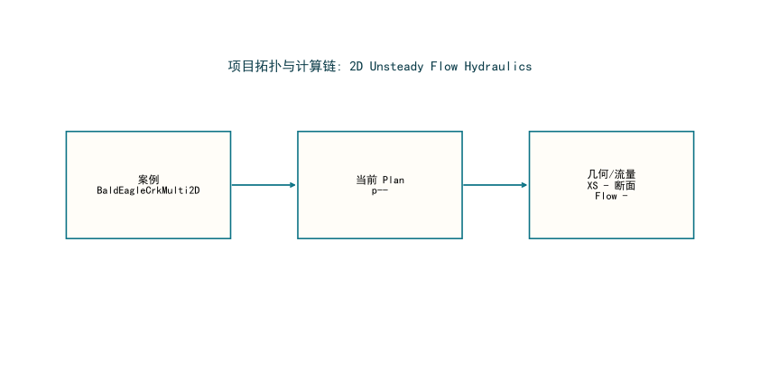

# HydroMind水网仿真结果报告: BaldEagleCrkMulti2D

**生成时间**: 2026-03-21 09:11:40

## 1. 问题描述

本报告关注 `BaldEagleCrkMulti2D` 的水网/河网仿真结果与 HydroMind 对比验证。案例类别为 `2D Unsteady Flow Hydraulics`。重点是水面线、过程线、峰值响应、HydroMind 对比精度和后续改进建议。

## 2. 水网拓扑

| 指标 | 数值 |
|---|---|
| 参考软件 | HEC-RAS |
| 当前 Plan | p- |
| 单位体系 | 国际单位制 (SI) |
| 聚合来源 | hecras_example_suite_chunk_40_49.json |

## 3. 解题思路

1. 在本机通过 `HEC-RAS COM + ras_commander` 真实打开工程并执行 `Compute_CurrentPlan`。
2. 自动识别当前 `Plan` 与结果 `HDF`，避免误把所有案例都当成 `p01`。
3. 基于 HEC-RAS 结果进行流态诊断（Froude 数、回水曲线类型），选择最合适的 HydroClaude 求解器。
4. 将结果统一转换为国际单位，计算统一误差指标（MAE/RMSE/P95），并在偏差过大时通过受约束迭代改善精度。

## 4. 结果图

## 5. 结果表

| 指标 | 数值 |
|---|---|
| 核心结论 | |
| 结果状态 | 当前未提取到通用仿真结果图 |
| 说明 | 需针对该物理模块单独定制结果提取 |
| 长度单位 | m |
| 流量单位 | m3/s |
| 详细指标 | |
| 案例名称 | BaldEagleCrkMulti2D |
| 类别 | 2D Unsteady Flow Hydraulics |
| 运行状态 | failed |
| 当前 Plan | p- |
| 结果来源 | hecras_example_suite_chunk_40_49.json |
| 结果 HDF | - |

## HEC-RAS vs HydroMind 对比

**状态**: 未完成

**原因**: 未执行对比

> 该案例尚未通过 HydroMind 对比流水线，或不在当前对标范围内。

## 6. 结论

- 该案例当前还没有形成可供人工核查的通用水力结果图，需要继续补结果提取适配。
- 当前阻塞: (-2147023170, '远程过程调用失败。', None, None)

## 7. 建议

- 该案例当前不在直接对标范围内，仅供巡检参考。

## 导航

- [返回案例索引](../index.html)
- [返回套件总览](../../hydromind_hecras_example_suite_report.html)
