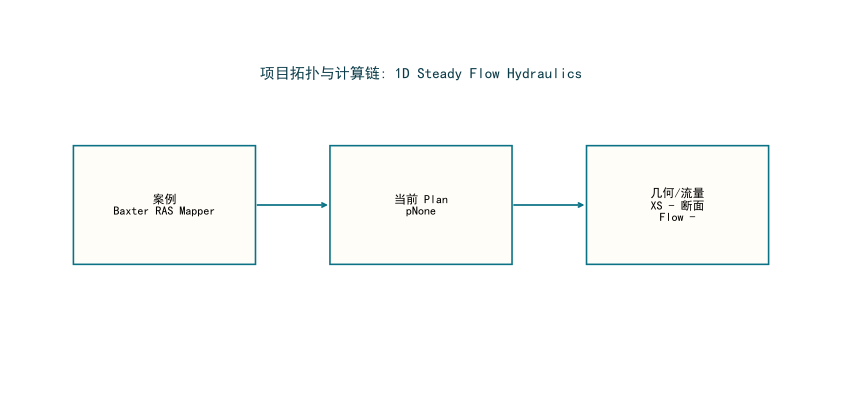

# HydroMind水网仿真结果报告: Baxter RAS Mapper

**生成时间**: 2026-03-21 09:10:07

## 1. 问题描述

本报告关注 `Baxter RAS Mapper` 的水网/河网仿真结果与 HydroMind 对比验证。案例类别为 `1D Steady Flow Hydraulics`。重点是水面线、过程线、峰值响应、HydroMind 对比精度和后续改进建议。

## 2. 水网拓扑

| 指标 | 数值 |
|---|---|
| 参考软件 | HEC-RAS |
| 当前 Plan | p- |
| 单位体系 | 国际单位制 (SI) |
| 聚合来源 | hecras_example_suite_chunk_00_09.json |

## 3. 解题思路

1. 在本机通过 `HEC-RAS COM + ras_commander` 真实打开工程并执行 `Compute_CurrentPlan`。
2. 自动识别当前 `Plan` 与结果 `HDF`，避免误把所有案例都当成 `p01`。
3. 基于 HEC-RAS 结果进行流态诊断（Froude 数、回水曲线类型），选择最合适的 HydroClaude 求解器。
4. 将结果统一转换为国际单位，计算统一误差指标（MAE/RMSE/P95），并在偏差过大时通过受约束迭代改善精度。

## 4. 结果图

## 5. 结果表

| 指标 | 数值 |
|---|---|
| 核心结论 | |
| 结果状态 | 当前未提取到通用仿真结果图 |
| 说明 | 需针对该物理模块单独定制结果提取 |
| 长度单位 | m |
| 流量单位 | m3/s |
| 详细指标 | |
| 案例名称 | Baxter RAS Mapper |
| 类别 | 1D Steady Flow Hydraulics |
| 运行状态 | computed |
| 当前 Plan | p- |
| 结果来源 | hecras_example_suite_chunk_00_09.json |
| 结果 HDF | - |

## HEC-RAS vs HydroMind 对比

**状态**: 未完成

**原因**: 未执行对比

> 该案例尚未通过 HydroMind 对比流水线，或不在当前对标范围内。

## 6. 结论

- 本页展示的是该案例当前实际求得的水面线、过程线或峰值包络结果。
- 对标建议: 看起来接近单河道稳态回水问题，可作为 HydroClaude 直接对比候选。
- 全部结果已统一换算为国际单位，图表使用中文字体配置，避免浏览器查看时汉字乱码。

## 7. 建议

- 尚未完成 HydroMind 对比，建议优先运行对比流水线。

## 导航

- [返回案例索引](../index.html)
- [返回套件总览](../../hydromind_hecras_example_suite_report.html)
