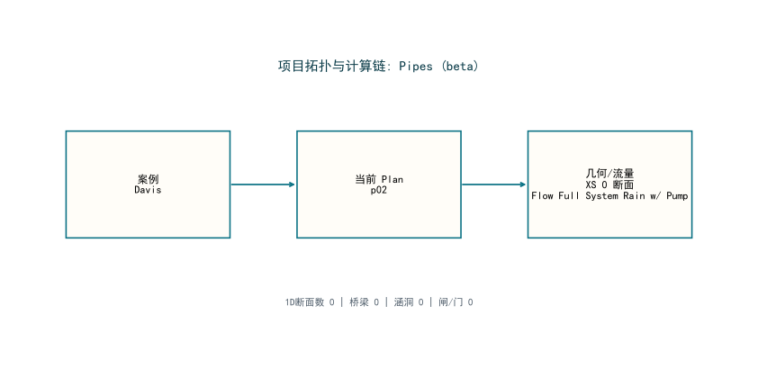

# HydroMind水网仿真结果报告: Davis

**生成时间**: 2026-03-20 22:31:26

## 1. 问题描述

本报告只关注该案例的水网/河网仿真结果。重点是当前水面线、过程线、峰值响应和河道平面结构，不讨论测试流程。

## 2. 工况与参考

| 指标 | 数值 |
|---|---|
| 参考软件 | HEC-RAS |
| 当前 Plan | p02 |
| 单位体系 | 国际单位制 (SI) |
| 聚合来源 | hecras_example_suite_chunk_60_67.json |

## 3. 水网拓扑图

## 4. 核心结论

| 指标 | 数值 |
|---|---|
| 结果状态 | 当前未提取到通用仿真结果图 |
| 说明 | 需针对该物理模块单独定制结果提取 |
| 长度单位 | m |
| 流量单位 | m3/s |

## 5. 解题思路

1. 在本机通过 `HEC-RAS COM + ras_commander` 真实打开工程并执行 `Compute_CurrentPlan`。
2. 自动识别当前 `Plan` 与结果 `HDF`，避免误把所有案例都当成 `p01`。
3. 将结果统一转换为国际单位，并提取能够支持人工核查的水面线、过程线和关键统计指标。
4. 若案例包含复杂结构物、混合流态或非恒定控制，则在结论中明确标为复杂能力校核，不冒充公平直接对标样例。

## 6. 结果图

## 7. 结果表

| 指标 | 数值 |
|---|---|
| 案例名称 | Davis |
| 类别 | Pipes (beta) |
| 运行状态 | computed |
| 当前 Plan | p02 |
| 结果来源 | hecras_example_suite_chunk_60_67.json |
| 结果 HDF | DavisStormSystem.p02.hdf |
| Plan 数 | 1 |
| 几何文件数 | 1 |
| 边界/流量文件数 | 1 |
| 断面数 | 0 |
| 桥梁数 | 0 |
| 涵洞数 | 0 |
| 闸门数 | 0 |

## 8. AI 结论建议

- 本页展示的是该案例当前实际求得的水面线、过程线或峰值包络结果。
- 对标建议: 不属于单河道稳态回水主线问题，当前不作为 HydroClaude 公平直接对标样例。
- 该几何以 1D 断面为主，适合作为后续 HydroClaude 明渠基线映射候选。
- 全部结果已统一换算为国际单位，图表使用中文字体配置，避免浏览器查看时汉字乱码。

## 9. 导航

- [返回案例索引](../index.html)
- [返回套件总览](../../hydromind_hecras_example_suite_report.html)
