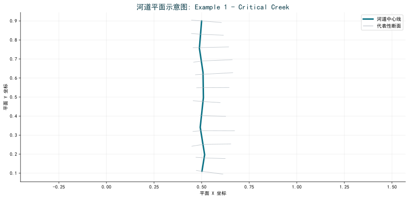
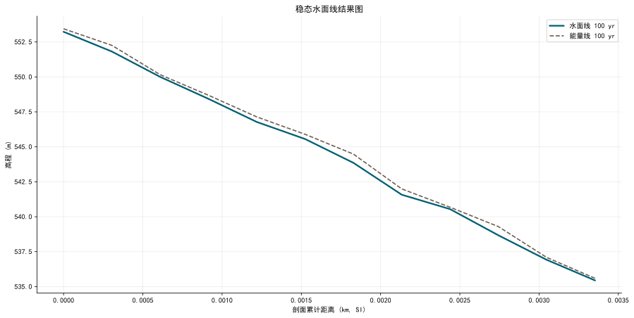
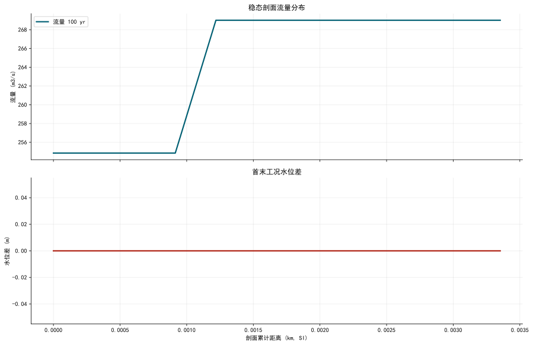

# HydroMind水网仿真结果报告: Example 1 - Critical Creek

**生成时间**: 2026-03-21 09:11:48

## 1. 问题描述

本报告关注 `Example 1 - Critical Creek` 的水网/河网仿真结果与 HydroMind 对比验证。案例类别为 `Applications Guide`。重点是水面线、过程线、峰值响应、HydroMind 对比精度和后续改进建议。

## 2. 水网拓扑

| 指标 | 数值 |
|---|---|
| 参考软件 | HEC-RAS |
| 当前 Plan | p01 |
| 单位体系 | 国际单位制 (SI) |
| 聚合来源 | hecras_example_suite_chunk_40_49.json |

## 3. 解题思路

1. 在本机通过 `HEC-RAS COM + ras_commander` 真实打开工程并执行 `Compute_CurrentPlan`。
2. 自动识别当前 `Plan` 与结果 `HDF`，避免误把所有案例都当成 `p01`。
3. 基于 HEC-RAS 结果进行流态诊断（Froude 数、回水曲线类型），选择最合适的 HydroClaude 求解器。
4. 将结果统一转换为国际单位，计算统一误差指标（MAE/RMSE/P95），并在偏差过大时通过受约束迭代改善精度。

## 4. 结果图

## 5. 结果表

| 指标 | 数值 |
|---|---|
| 核心结论 | |
| 结果模式 | 稳态 |
| 最大水位 | 553.229 m |
| 最小水位 | 535.445 m |
| 代表流量 | 269.010 m3/s |
| 详细指标 | |
| 案例名称 | Example 1 - Critical Creek |
| 类别 | Applications Guide |
| 运行状态 | computed |
| 当前 Plan | p01 |
| 结果来源 | hecras_example_suite_chunk_40_49.json |
| 结果 HDF | CRITCREK.p01.hdf |
| Plan 数 | 2 |
| 几何文件数 | 2 |
| 边界/流量文件数 | 2 |
| 断面数 | 63 |
| 桥梁数 | 0 |
| 涵洞数 | 0 |
| 闸门数 | 0 |
| 结果模式 | 稳态 |
| 剖面数 | 1 |
| 最大水位 | 553.229 m |
| 最小水位 | 535.445 m |
| 代表流量 | 269.010 m3/s |
| 河段数 | 1 |

## HEC-RAS vs HydroMind 对比

**状态**: 未完成

**原因**: 未执行对比

> 该案例尚未通过 HydroMind 对比流水线，或不在当前对标范围内。

## 6. 结论

- 本页展示的是该案例当前实际求得的水面线、过程线或峰值包络结果。
- 对标建议: 不属于单河道稳态回水主线问题，当前不作为 HydroClaude 公平直接对标样例。
- 该几何以 1D 断面为主，适合作为后续 HydroClaude 明渠基线映射候选。
- 结果曲线已按 1 个 river/reach 河段分组重排，避免多河段案例因断面编号交错而出现假性锯齿。
- 报告中的水面线图反映的是 HEC-RAS 多剖面稳态结果，适合人工核查回水线单调性、能量线位置和不同工况间的水位差。
- 全部结果已统一换算为国际单位，图表使用中文字体配置，避免浏览器查看时汉字乱码。

## 7. 建议

- 该案例当前不在直接对标范围内，仅供巡检参考。

## 导航

- [返回案例索引](../index.html)
- [返回套件总览](../../hydromind_hecras_example_suite_report.html)
