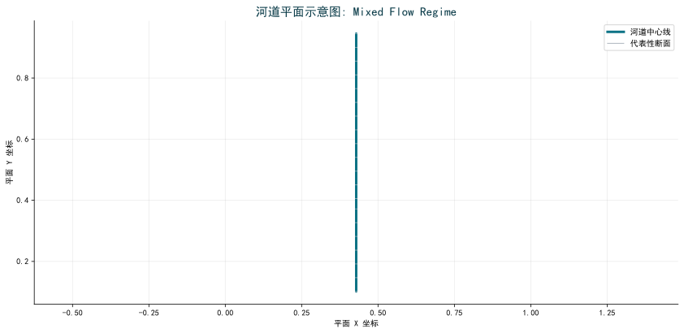
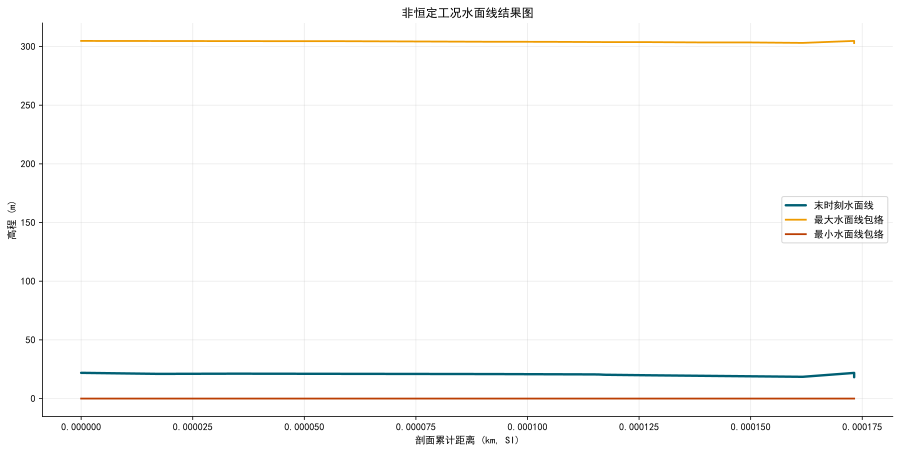
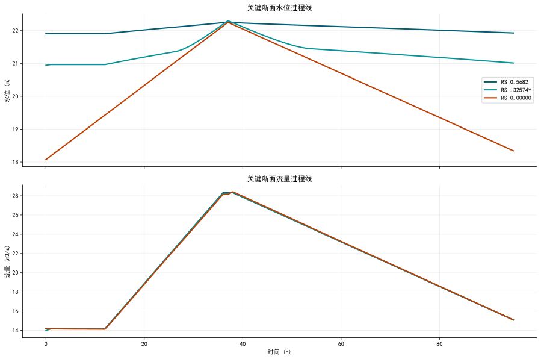

# HydroMind水网仿真结果报告: Mixed Flow Regime

**生成时间**: 2026-03-21 13:21:12

## 1. 问题描述

本报告只关注该案例的水网/河网仿真结果。重点是当前水面线、过程线、峰值响应和河道平面结构，不讨论测试流程。

## 2. 工况与参考

| 指标 | 数值 |
|---|---|
| 参考软件 | HEC-RAS |
| 当前 Plan | p02 |
| 单位体系 | 国际单位制 (SI) |
| 聚合来源 | hecras_example_suite_chunk_20_29.json |

## 3. 水网拓扑图

## 4. 核心结论

| 指标 | 数值 |
|---|---|
| 结果模式 | 非恒定 |
| 峰值水位 | 22.410 m |
| 峰值流量 | 28.412 m3/s |
| 总历时 | 95.00 h |

## 5. 解题思路

1. 在本机通过 `HEC-RAS COM + ras_commander` 真实打开工程并执行 `Compute_CurrentPlan`。
2. 自动识别当前 `Plan` 与结果 `HDF`，避免误把所有案例都当成 `p01`。
3. 将结果统一转换为国际单位，并提取能够支持人工核查的水面线、过程线和关键统计指标。
4. 若案例包含复杂结构物、混合流态或非恒定控制，则在结论中明确标为复杂能力校核，不冒充公平直接对标样例。

## 6. 结果图

## 7. 结果表

| 指标 | 数值 |
|---|---|
| 案例名称 | Mixed Flow Regime |
| 类别 | 1D Unsteady Flow Hydraulics |
| 运行状态 | computed |
| 当前 Plan | p02 |
| 结果来源 | hecras_example_suite_chunk_20_29.json |
| 结果 HDF | MixedFlow.p02.hdf |
| Plan 数 | 2 |
| 几何文件数 | 1 |
| 边界/流量文件数 | 2 |
| 断面数 | 153 |
| 桥梁数 | 0 |
| 涵洞数 | 0 |
| 闸门数 | 0 |
| 结果模式 | 非恒定 |
| 时步数 | 96 |
| 断面数 | 153 |
| 河段数 | 1 |
| 总历时 | 95.00 h |
| 最大水位 | 22.410 m |
| 最大流量 | 28.412 m3/s |

## 8. AI 结论建议

- 本页展示的是该案例当前实际求得的水面线、过程线或峰值包络结果。
- 对标建议: 含桥梁/结构物/混合流态/2D 等复杂物理，当前 HydroClaude 不能公平直接对标。
- 该几何以 1D 断面为主，适合作为后续 HydroClaude 明渠基线映射候选。
- 结果曲线已按 1 个 river/reach 河段分组重排，避免多河段案例因断面编号交错而出现假性锯齿。
- 报告中的末时刻水面线与关键断面过程线反映的是非恒定解的传播和峰值响应，可直接用于人工检查是否存在异常振荡或不合理尖峰。
- 全部结果已统一换算为国际单位，图表使用中文字体配置，避免浏览器查看时汉字乱码。

## 9. 导航

- [返回案例索引](../index.html)
- [返回套件总览](../../hydromind_hecras_example_suite_report.html)
